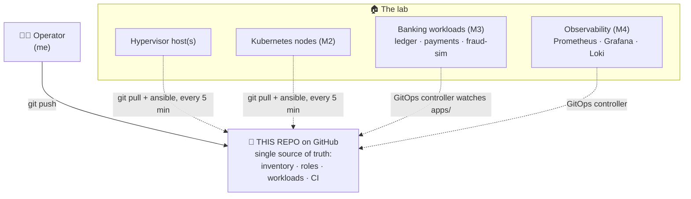
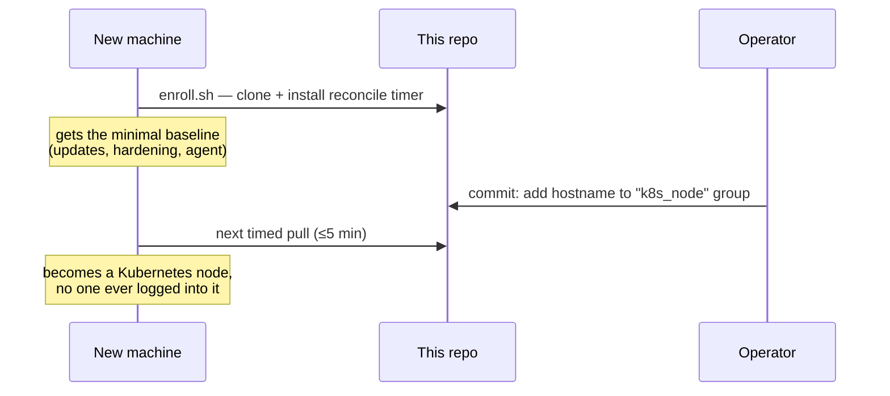
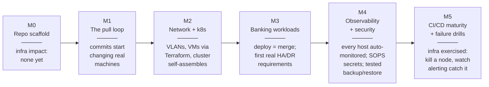

# The lab at a glance

A visual tour of what this lab is and how it works — written for any
reader, technical or not. Diagrams render directly on GitHub.

**One sentence**: this repo *is* the lab's control plane — every
machine in the lab continuously pulls this repository and reshapes
itself to match what's written here, so operating the entire
infrastructure means editing files in Git.

## The nerve center

Nothing pushes config *to* machines. Every machine pulls, on a timer,
and self-heals any drift — a machine that someone hand-edits reverts
to the repo's desired state on its next pull. Adding a machine to the
lab is one command (`bootstrap/enroll.sh`); deciding what that machine
*becomes* is a Git commit that moves its hostname into a group.

## Milestones and what each one changes in the infra

Full details per milestone: [`ROADMAP.md`](../ROADMAP.md). Current
state: [`STATUS.md`](../STATUS.md). The design and its trade-offs
(why pull not push, why a public repo makes enrollment trivial, how
secrets are the one deliberate exception): [`ARCHITECTURE.md`](../ARCHITECTURE.md).

## How it's validated

Same doctrine as any production platform, scaled to a lab: CI lints
every change (YAML, Ansible; Terraform plan and image scanning join at
M2/M5), and the end state (M5) is scheduled failure drills — kill a
node on purpose, verify the HA design holds and the alerting actually
fires, write up the results in `docs/`.
