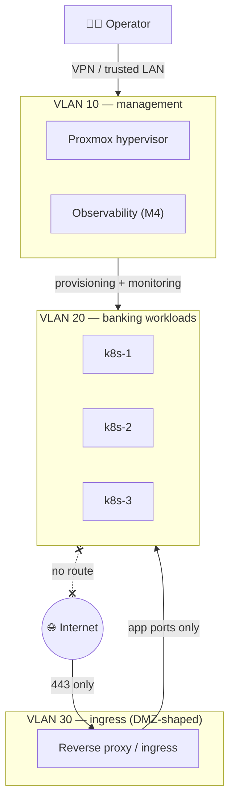

# Network design (M2)

Why segmentation is half the point of this lab: a bank's ops
environment is defined by blast-radius control — management access,
application traffic, and internet-facing surfaces live on separate
segments with explicit rules between them. This lab reproduces that
shape at homelab scale, so it's demonstrable rather than theoretical.

Rules of the topology (enforced at the router/firewall, documented here
so the intent survives the lab):

| From → To | Allowed | Why |
|---|---|---|
| Internet → ingress | 443 only | The single exposed surface |
| ingress → banking | app ports only | Ingress terminates TLS, forwards to workloads |
| banking → internet | **nothing** | Workloads have no business calling out; exfiltration-shaped traffic should be impossible by construction |
| management → banking | provisioning + scrape ports | Ansible/monitoring reach in; never the reverse |
| banking → management | **nothing** | A compromised workload can't reach the hypervisor |

The one deliberate exception: every segment may reach GitHub over 443,
because the pull loop (see `ARCHITECTURE.md`) *is* the management
mechanism — that's the trade this design makes explicit rather than
hides.
